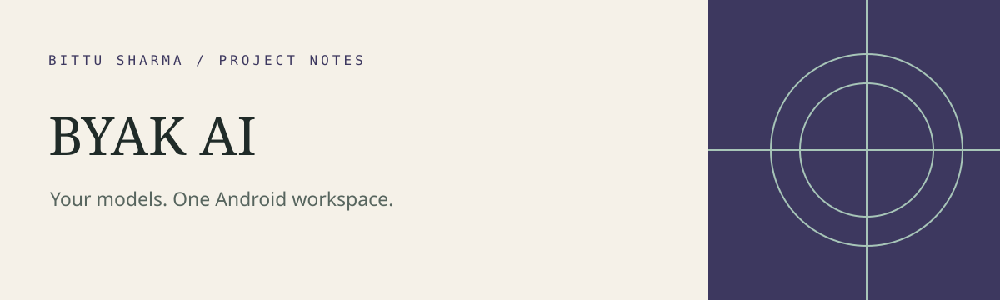
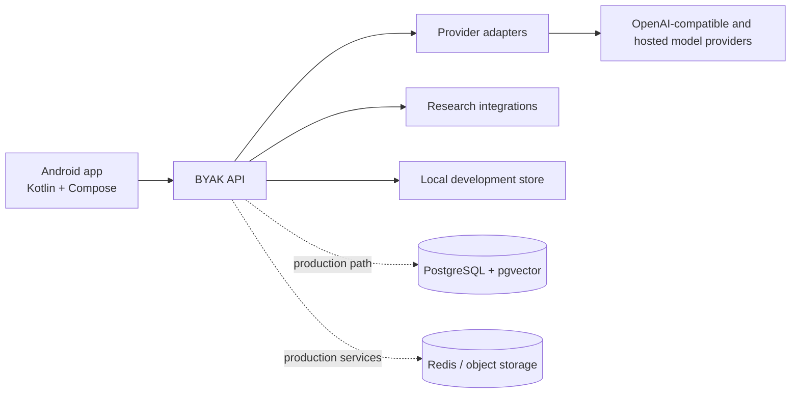

# BYAK AI

<!-- repo-badges:start -->
<div align="center">

[](https://github.com/honeyamn10-source/ai-app/stargazers)
[](https://github.com/honeyamn10-source/ai-app/forks)
[](https://github.com/honeyamn10-source/ai-app/issues)
[](https://github.com/honeyamn10-source/ai-app/commits/main)

[Repository](https://github.com/honeyamn10-source/ai-app) · [Issues](https://github.com/honeyamn10-source/ai-app/issues) · [Pull Requests](https://github.com/honeyamn10-source/ai-app/pulls) · [Actions](https://github.com/honeyamn10-source/ai-app/actions)

</div>
<!-- repo-badges:end -->

<!-- professional-meta:start -->
<div align="center">

[](https://github.com/honeyamn10-source/ai-app/actions/workflows/ci.yml)

   

[Documentation](docs) · [Contributing](CONTRIBUTING.md) · [Security](SECURITY.md) · [Changelog](CHANGELOG.md) · [Code of Conduct](CODE_OF_CONDUCT.md) · [Third-party notices](THIRD_PARTY_NOTICES.md)

</div>
<!-- professional-meta:end -->


**Bring Your API Key. Bring Your Intelligence.**

> **No server needed.** The Android app runs entirely on the phone by default: it calls OpenAI, Anthropic, Gemini and other providers directly with the user's own key (encrypted with the Android Keystore) and keeps all data on the device. The Node API in `backend/` is optional, for teams that want accounts and data on their own server.

BYAK AI is a development foundation for a multi-provider Android AI assistant. This repository contains a runnable zero-dependency reference API, a PostgreSQL/pgvector production schema, and a native Kotlin/Jetpack Compose client.

This guide describes the default `main` branch. Versioned release work may live on other branches; confirm the branch and its checks before building a store release.

<!-- architecture-showcase:start -->
## Architecture



The default repository can run with its local reference store; PostgreSQL, Redis and object storage are production-oriented paths documented in the repository.
<!-- architecture-showcase:end -->

## Implemented components

**Backend (zero-dependency Node 22 API)**
- Email + Google Sign-In, rotating refresh tokens with reuse detection, device list/revocation, password change, account deletion and full JSON data export
- Server-encrypted BYOK connections (AES-256-GCM, masked keys, key rotation) for OpenAI, Anthropic, Gemini, OpenRouter, Groq, Mistral, DeepSeek, custom HTTPS OpenAI-compatible endpoints and (self-hosted) Ollama
- True token streaming from every provider over SSE; stopping a response keeps the partial answer; regenerate, edit & resend, delete message
- Image attachments for vision models, web search in chat and automatic link reading with citations, prompt library with built-in templates
- Prompts combine custom instructions, project instructions, opt-in memory and BM25 document retrieval with citations
- Conversations with search, pin, archive, rename and move-to-project; Markdown/TXT/JSON exports
- GitHub, Reddit and Brave web research, SSRF-safe URL reader (DNS-checked, size-capped)
- Google Play subscriptions: server-side verification, acknowledgement, account binding, upgrades, renewals and real-time developer notifications; Free/Pro plan limits
- Per-model token usage statistics, audit events, rate limiting, security headers, graceful shutdown

**Android (Kotlin + Jetpack Compose)**
- Automatic session refresh and Keystore-encrypted token storage
- Streaming chat with Markdown, stop/regenerate/edit/copy/share, citations and a live model picker
- Photo attachments, voice input, read-aloud answers, a Web toggle and a prompt library
- Appearance (system/light/dark, Material You) and a configurable server address
- Research with one-tap AI summaries, knowledge files, projects with instructions, provider management with key testing
- BYAK Pro purchase flow with Google Play Billing, restore and subscription management
- Memory, usage charts, devices, profile and custom instructions, data export
- Drawer + bottom bar on phones, navigation rail on tablets, dark/light themes

## Honest release status

This is a tested source deliverable, not a production-signed Play Store release. Google Sign-In needs `BYAK_GOOGLE_WEB_CLIENT_ID` (Android) and `GOOGLE_*_CLIENT_ID` (server). Purchases need Play Console products plus `GOOGLE_PLAY_SERVICE_ACCOUNT_JSON` — see [docs/billing/GOOGLE_PLAY_BILLING.md](docs/billing/GOOGLE_PLAY_BILLING.md). PDF/DOCX extraction, malware scanning, object storage and semantic embeddings still need production services. No signing key or API secret is included.

## Run the API

Requirements: Node.js 22+.

```bash
cp .env.example .env
# Set secure BYAK_MASTER_KEY and BYAK_TOKEN_SECRET values in your environment.
node backend/src/server.mjs
```

The development defaults run at `http://localhost:8787`. Verify:

```bash
curl http://localhost:8787/health
npm test
```

The reference API uses an encrypted-permissions local JSON store so it runs immediately. Production deployment should replace `Store` with the PostgreSQL repository described in `backend/migrations/001_initial.sql`.

## Google Sign-In setup

The app ships with the **Web application** client ID `1077439001893-rnboa31….apps.googleusercontent.com` from Google Cloud project `byak-ai` (override with `-PBYAK_GOOGLE_WEB_CLIENT_ID=…`). For the account picker to work on a Play-installed build, the same Google Cloud project also needs an **Android** OAuth client for package `ai.byak.app` with the **SHA-1 of the Play App Signing key** (Play Console → Test and release → App integrity → App signing). Add the upload key's SHA-1 too if you install builds outside Play.

## Run Android

1. Open `android/` in Android Studio.
2. Use JDK 17, Gradle 8.13 and Android SDK 35. The build uses Kotlin 2.3.0 and Android Gradle Plugin 8.13.2, including Kotlin 2.3-compatible R8.
3. Start the API, then run the `debug` variant on an emulator. It uses `http://10.0.2.2:8787`.
4. For a physical device or hosted API, build with:

```bash
gradle -p android -PBYAK_API_URL=https://api.example.com assembleDebug
```

Optional build properties (Gradle `-P` or environment variables): `BYAK_GOOGLE_WEB_CLIENT_ID` enables Google Sign-In; `BYAK_PLAY_MONTHLY_PRODUCT_ID` / `BYAK_PLAY_ANNUAL_PRODUCT_ID` override the subscription product ids.

Release bundle (unsigned until your keystore is configured):

```bash
gradle -p android -PBYAK_API_URL=https://api.example.com bundleRelease
```

Never add a keystore or signing password to Git. Configure Play App Signing through Google Play Console and a protected CI secret.

## Production services

```bash
docker compose up -d postgres redis minio
psql "$DATABASE_URL" -f backend/migrations/001_initial.sql
docker build -f backend/Dockerfile -t byak-api .
```

Terminate TLS at a trusted reverse proxy, inject secrets from a managed secret store, use Redis for distributed rate limiting/session revocation, use PostgreSQL repositories, and route uploaded files through object storage plus a sandboxed ClamAV/document worker.

## Repository

```text
android/                 Native Kotlin + Jetpack Compose app
backend/src/             Runnable API and provider/tool services
backend/migrations/      PostgreSQL + pgvector production schema
backend/test/            Node unit and API integration tests
docs/                    Architecture, security, API and release guidance
.github/workflows/       Build, test, SBOM and security scan CI
```

## Plans

| | Free | Pro ($1 / month or $10 / year) |
|---|---|---|
| Live web search in chat | 10 per day | 200 per day |
| Compare two models side by side | 2 per day | 100 per day |
| Photo questions (vision) | 12 images per day | 500 per day |
| Conversation memory sent to the model | last 20 messages | last 100 messages |
| Document excerpts per answer | 4 | 10 |
| Projects | 3 | 200 |
| Knowledge files | 25 | 2,000 |
| Saved prompts | 5 | 200 |
| Saved memories | 50 | 2,000 |
| Research searches per day | 50 | 1,000 |
| Provider connections | 3 | 50 |

Limits are enforced by the API, not the app. Daily allowances reset at midnight UTC. Play Console setup: one subscription `byak_pro` with base plans `monthly` and `yearly`; add a free-trial offer to each base plan and the app shows it automatically to eligible users. Yearly shows its live saving versus monthly (about 17% at $10 vs $1).

Limits live in `backend/src/billing.mjs`. Prices are set per country in Play Console.

BYOK provider charges remain between users and their selected provider. Never represent a paid third-party model as unlimited or free.

## License

The original BYAK AI code in this repository is proprietary unless the owner selects another license. Third-party dependencies retain their own licenses; see `THIRD_PARTY_NOTICES.md`.
