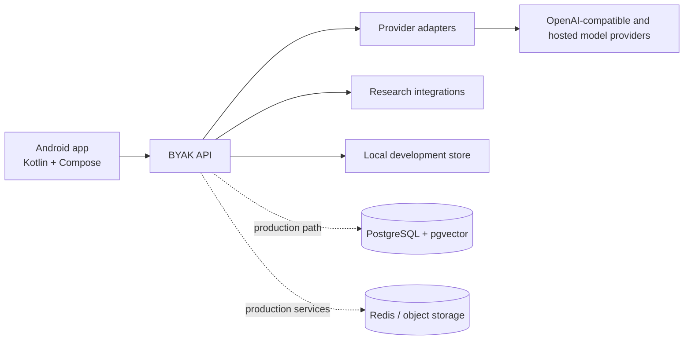

# BYAK AI

<!-- repo-badges:start -->
<div align="center">

[](https://github.com/honeyamn10-source/ai-app/stargazers)
[](https://github.com/honeyamn10-source/ai-app/forks)
[](https://github.com/honeyamn10-source/ai-app/issues)
[](https://github.com/honeyamn10-source/ai-app/commits/main)

[Repository](https://github.com/honeyamn10-source/ai-app) · [Issues](https://github.com/honeyamn10-source/ai-app/issues) · [Pull Requests](https://github.com/honeyamn10-source/ai-app/pulls) · [Actions](https://github.com/honeyamn10-source/ai-app/actions)

</div>
<!-- repo-badges:end -->

<!-- professional-meta:start -->
<div align="center">

[](https://github.com/honeyamn10-source/ai-app/actions/workflows/ci.yml)

   

[Documentation](docs) · [Contributing](CONTRIBUTING.md) · [Security](SECURITY.md) · [Changelog](CHANGELOG.md) · [Code of Conduct](CODE_OF_CONDUCT.md) · [Third-party notices](THIRD_PARTY_NOTICES.md)

</div>
<!-- professional-meta:end -->


**Bring Your API Key. Bring Your Intelligence.**

BYAK AI is a development foundation for a multi-provider Android AI assistant. This repository contains a runnable zero-dependency reference API, a PostgreSQL/pgvector production schema, and a native Kotlin/Jetpack Compose client.

This guide describes the default `main` branch. Versioned release work may live on other branches; confirm the branch and its checks before building a store release.

<!-- architecture-showcase:start -->
## Architecture



The default repository can run with its local reference store; PostgreSQL, Redis and object storage are production-oriented paths documented in the repository.
<!-- architecture-showcase:end -->

## Implemented components

- Email registration/login, rotating refresh sessions, device revocation and account deletion
- Server-encrypted BYOK connections with masked credentials
- OpenAI, Anthropic, Gemini, OpenRouter, Groq, Mistral, DeepSeek and custom OpenAI-compatible endpoints
- Model catalog and remote credential/model validation
- Conversations, message history and extensible SSE event streaming
- Project workspaces
- GitHub, Reddit and configurable Brave web research with source URLs
- Secure text/Markdown/CSV/JSON upload, chunking, lexical retrieval and document citations
- User-controlled memory architecture, free entitlements, admin authorization and audit events
- Markdown, TXT and JSON conversation exports
- Native Android screens for Home, Chats, Research, Files, Projects, Models and Settings
- Dark/light themes, adaptive phone/tablet navigation, empty/loading/error states
- PostgreSQL + pgvector migration, Docker services, CI, tests and security documentation

## Honest release status

This is a tested source deliverable, not a production-signed Play Store release. The Android build requires Android Studio/SDK or the CI workflow. Google OAuth, Google Play purchase verification, PDF/DOCX extraction/export, malware scanning, production object storage, semantic embeddings and provider calls require the corresponding credentials/services. No signing key or API secret is included.

## Run the API

Requirements: Node.js 22+.

```bash
cp .env.example .env
# Set secure BYAK_MASTER_KEY and BYAK_TOKEN_SECRET values in your environment.
node backend/src/server.mjs
```

The development defaults run at `http://localhost:8787`. Verify:

```bash
curl http://localhost:8787/health
npm test
```

The reference API uses an encrypted-permissions local JSON store so it runs immediately. Production deployment should replace `Store` with the PostgreSQL repository described in `backend/migrations/001_initial.sql`.

## Run Android

1. Open `android/` in Android Studio.
2. Use JDK 17, Gradle 8.13 and Android SDK 35. The build uses Kotlin 2.3.0 and Android Gradle Plugin 8.13.2, including Kotlin 2.3-compatible R8.
3. Start the API, then run the `debug` variant on an emulator. It uses `http://10.0.2.2:8787`.
4. For a physical device or hosted API, build with:

```bash
gradle -p android -PBYAK_API_URL=https://api.example.com assembleDebug
```

Release bundle (unsigned until your keystore is configured):

```bash
gradle -p android -PBYAK_API_URL=https://api.example.com bundleRelease
```

Never add a keystore or signing password to Git. Configure Play App Signing through Google Play Console and a protected CI secret.

## Production services

```bash
docker compose up -d postgres redis minio
psql "$DATABASE_URL" -f backend/migrations/001_initial.sql
docker build -f backend/Dockerfile -t byak-api .
```

Terminate TLS at a trusted reverse proxy, inject secrets from a managed secret store, use Redis for distributed rate limiting/session revocation, use PostgreSQL repositories, and route uploaded files through object storage plus a sandboxed ClamAV/document worker.

## Repository

```text
android/                 Native Kotlin + Jetpack Compose app
backend/src/             Runnable API and provider/tool services
backend/migrations/      PostgreSQL + pgvector production schema
backend/test/            Node unit and API integration tests
docs/                    Architecture, security, API and release guidance
.github/workflows/       Build, test, SBOM and security scan CI
```

## Plans

- Free: BYOK, basic chat, research, files and exports
- Monthly: configurable Play product, suggested price USD $1
- Annual: configurable Play product, suggested price USD $10

BYOK provider charges remain between users and their selected provider. Never represent a paid third-party model as unlimited or free.

## License

The original BYAK AI code in this repository is proprietary unless the owner selects another license. Third-party dependencies retain their own licenses; see `THIRD_PARTY_NOTICES.md`.
