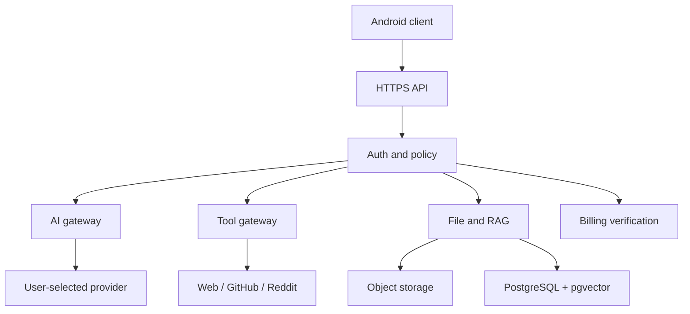

# Architecture

## Boundaries

The Android application never contains administrator provider keys. BYOK values are sent only over TLS, envelope-encrypted server-side and displayed only as a suffix. Device-local provider support can use `CredentialVault` when local providers are enabled.

## Layers

- Client presentation: adaptive Compose UI and observable state.
- Client data: API client with transparent token refresh, Keystore-encrypted session persistence and Play Billing.
- API boundary: input limits, structured errors, auth, ownership checks and rate limiting.
- Domain services: streaming provider gateway, research tools, BM25 RAG, memory, exports, usage and Google Play entitlements.
- Persistence: runnable file repository for local development; PostgreSQL schema for production.
- Async workers: required production boundary for malware scanning, PDF/DOCX extraction, embeddings and rich exports.

## Streaming protocol

SSE events are `message_start`, `content_delta`, `reasoning_delta`, `tool_call`, `tool_result`, `citation`, `usage`, `message_complete`, and `error`. The current adapter returns a provider response through incremental `content_delta` events; adapters can later pass through true upstream streaming without changing the client protocol.

## Local AI

Ollama and OpenAI-compatible local endpoints fit the provider interface, but direct device-to-LAN access is deliberately disabled in the production network policy. The UI labels this capability **Coming soon**.

